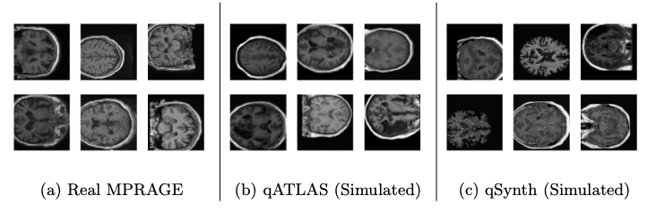

<div align="center">

# Domain-Agnostic Stroke Lesion Segmentation Using Physics-Constrained Synthetic Data

[](https://miccai2025.org)
[](https://opensource.org/licenses/MIT)

*A framework for robust stroke lesion segmentation across heterogeneous MRI domains using physics-based synthetic data generation*

[Overview](#overview) | [Installation](#installation) | [Usage](#usage) | [Results](#results)

</div>

---

## Overview

We present two novel methods for domain-agnostic stroke lesion segmentation:
1. **qATLAS**: A neural network that estimates qMRI maps from standard MPRAGE images
2. **qSynth**: A direct synthesis approach for qMRI maps using label-conditioned Gaussian mixture models

Both methods leverage physics-based forward models to ensure physical plausibility in the simulated images.

<details>
<summary><b>🔍 Key Features</b></summary>

- Physics-constrained synthetic data generation
- Robust performance across multiple MRI modalities
- Domain-agnostic segmentation capabilities
- Extensive validation on clinical datasets
</details>

## Examples

<div align="center">
  
</div>

## Installation

To set up the required environment, run:

```bash
pip install -r requirements.txt
```

## Usage

After installing dependencies, you can explore the available scripts:

```bash
python src/train_seg.py --help
python src/train_mprage.py --help
```

## Results

For detailed results and qualitative examples, please refer to our MICCAI 2025 paper.

## Pretrained Models

We plan to release pretrained model weights in the near future. Stay tuned for updates.

## Citation

If you use this code, please cite our work:

```bibtex
@misc{chalcroft2024domainagnosticstrokelesionsegmentation,
      title={Domain-Agnostic Stroke Lesion Segmentation Using Physics-Constrained Synthetic Data}, 
      author={Liam Chalcroft and Jenny Crinion and Cathy J. Price and John Ashburner},
      year={2024},
      eprint={2412.03318},
      archivePrefix={arXiv},
      primaryClass={eess.IV},
      url={https://arxiv.org/abs/2412.03318}, 
}
```
